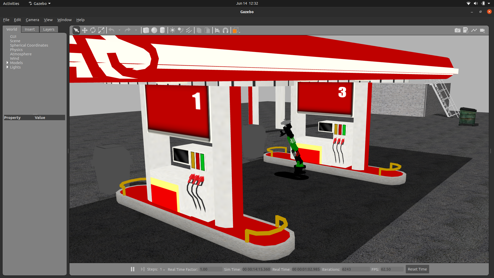
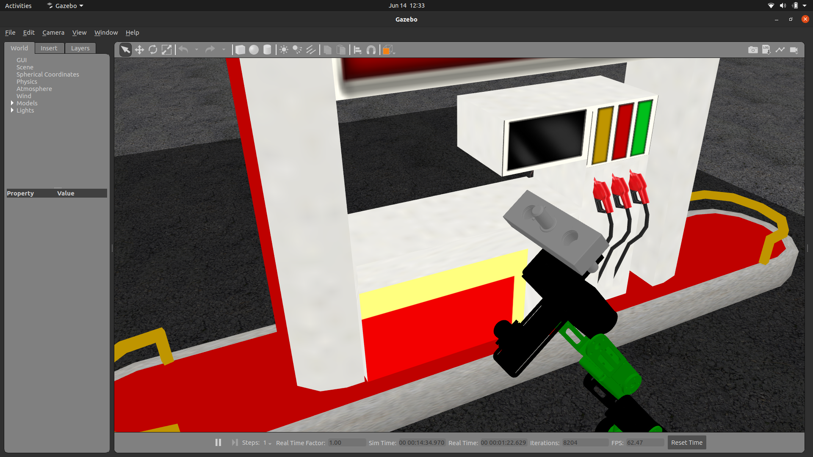

# robotic-arm-refuelling
A ROS package simulating multiple cases of autonomous vehicle refuelling using robotic arms. 

Check the commit logs for a detailed description of the future scope of the project.

## To do

- car urdf modified with female component and visual odometry pattern
- car controller
- demo scripts for static refuelling with cvbridge
- new car urdf with arm & male connector
- adjust inertia values for dofbot components
- testing to collect data for static refuelling (write nodes)
    - time for refuelling
    - payload capacity
    - end effector details
    - arm velocity
    - edge detections
    - docking and undocking time
    - alignment accuracy while docking (x, y, z)

**Deadline - 16th June, 2023**

## Setup Instructions

*This section assumes the pre-installation of ROS1 Noetic on a system running Ubuntu 20.04 in a virtual environment*

1. Clone the repository in your catkin workspace source folder
2. Run `catkin_make` in the workspace
3. Run `source devel/setup.bash` in the workspace
4. Run `roslaunch robotic-arm-refuelling dofbot_world.launch` to launch the simulation environment for the static refuelling use case.

## Terminology

- **Static refuelling** - The vehicle is moving and the robotic arm is statically mounted and used to refuel the vehicle.
- **Dynamic refuelling** - The vehicle is moving and the robotic arm is mounted on a dynamic base and used to refuel the vehicle.

## Keywords for Literature survey 

1. situational awareness in space
2. space RPOD (rendezvous proximity operations and docking)
3. satellite identification using star trackers

